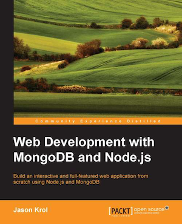

[](https://gitpitch.com/enogrob/ebook-project/master)
```
Roberto Nogueira  
BSd EE, MSd CE
Solution Integrator Experienced - Certified by Ericsson
```
# eBook project



**About**

Learn everything you need to about the subject of this `eBook` project.

[Homepage](https://www.packtpub.com/web-development/web-development-mongodb-and-nodejs)

## Topics
```
1: WELCOME TO JAVASCRIPT IN THE FULL STACK
[ ] Node.js changed JavaScript forever
[ ] The NoSQL movement
[ ] Summary
2: GETTING UP AND RUNNING
[ ] Environment assumptions and requirements
[ ] Installing Node.js
[ ] Installing the MongoDB server
[ ] Writing your first app
[ ] Summary
3: NODE AND MONGODB BASICS
[ ] A JavaScript Primer
[ ] The basics of NodeJS
[ ] Installing modules using npm
[ ] The basics of MongoDB
[ ] Additional resources
[ ] Summary
4: WRITING AN EXPRESS.JS SERVER
[ ] What is Express.js?
[ ] Building a complete web application
[ ] Organizing the files
[ ] Server.js – where it all begins
[ ] Configuration module
[ ] Routers and controllers
[ ] Custom middleware
[ ] Migrating to Express v4.0.0
[ ] Summary
5: DYNAMIC HTML WITH HANDLEBARS
[ ] Basic syntax for Handlebars
[ ] Views
[ ] Layouts
[ ] Partial views
[ ] Handlebars Helpers
[ ] Rendering the views
[ ] Summary
6: CONTROLLERS AND VIEW MODELS
[ ] Controllers
[ ] View models
[ ] Updating the home controller
[ ] Updating the image controller
[ ] Helpers for reusable code
[ ] Iterating on the UI
[ ] Summary
7: PERSISTING DATA WITH MONGODB
[ ] Using MongoDB with Node
[ ] Introducing Mongoose
[ ] Defining the schema and models
[ ] Adding CRUD to the controllers
[ ] Iterating by adding an image removal capability
[ ] Refactoring and improvements
[ ] Summary
8: CREATING A RESTFUL API
[ ] What is an API?
[ ] What is a RESTful API?
[ ] Introducing Postman REST Client
[ ] Creating a Basic API server
[ ] Responding to GET requests
[ ] Receiving data – POST and PUT requests
[ ] Removing data – DELETE
[ ] Consuming external APIs from Node.js
[ ] Summary
9: TESTING YOUR CODE
[ ] Tools of the trade
[ ] Writing and running your first test
[ ] Testing the application
[ ] Spy and stub everything!
[ ] Summary
10: DEPLOYING WITH CLOUD-BASED SERVICES
[ ] Cloud versus traditional hosting
[ ] Introduction to Git
[ ] Deploying your application
[ ] Summary
11: SINGLE PAGE APPLICATIONS WITH POPULAR FRONTEND FRAMEWORKS
[ ] What is a Single Page Application?
[ ] Why use a frontend framework?
[ ] Frontend development tools
[ ] Testing and test-driven development
[ ] Summary
12: POPULAR NODE.JS WEB FRAMEWORKS
[ ] Meteor
[ ] Sails
[ ] hapi
[ ] Koa
[ ] Flatiron
[ ] Summary
```
